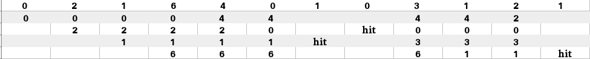
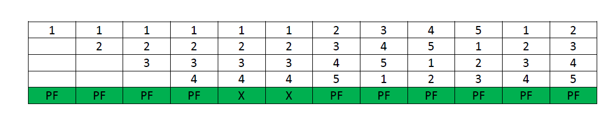
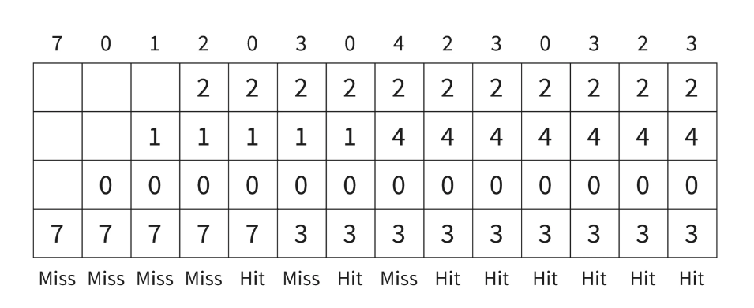
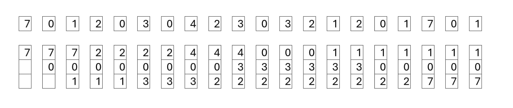
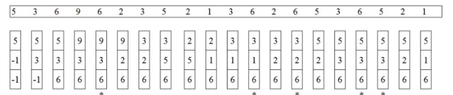
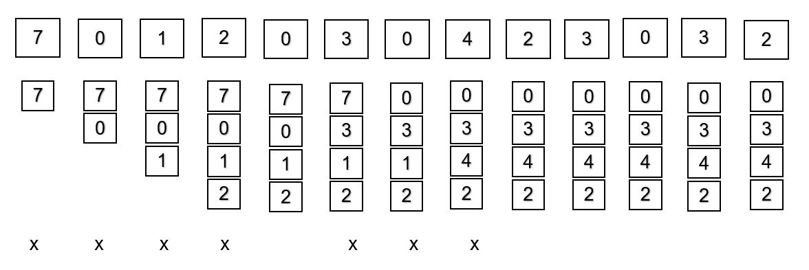
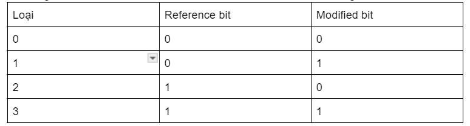
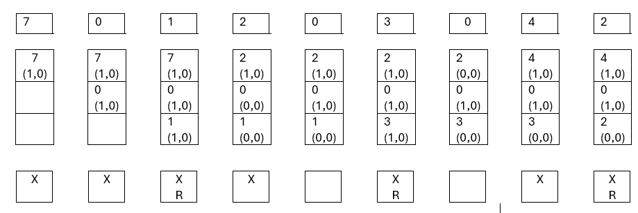
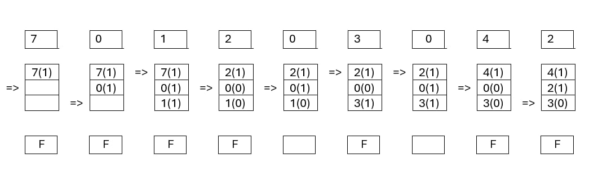

# BÀI TẬP LỚN HỆ ĐIỀU HÀNH


CHỦ ĐỀ XÂY DỰNG CHƯƠNG TRÌNH MINH HỌA CHO THUẬT TOÁN THAY THẾ TRANG 

> Link sản phẩm  :https://kienle141204.github.io/it3070-Page-Replacement-Algorithms/


- [BÀI TẬP LỚN HỆ ĐIỀU HÀNH](#bài-tập-lớn-hệ-điều-hành)
  - [I. Tổng quan về Quản lý bộ nhớ trong Hệ điều hành.](#i-tổng-quan-về-quản-lý-bộ-nhớ-trong-hệ-điều-hành)
  - [II. Tổng quan về thuật toán thay thế trang.](#ii-tổng-quan-về-thuật-toán-thay-thế-trang)
    - [Cơ chế hoạt động :](#cơ-chế-hoạt-động-)
    - [Vai trò của thuật toán thay thế trang :](#vai-trò-của-thuật-toán-thay-thế-trang-)
  - [III. Một số thuật toán thay thế phổ biến.](#iii-một-số-thuật-toán-thay-thế-phổ-biến)
    - [1.FIFO -First In First Out .](#1fifo--first-in-first-out-)
      - [1.1 . Khái niệm](#11--khái-niệm)
      - [1.2 . Mô tả thuật toán](#12--mô-tả-thuật-toán)
      - [1.3 .Bất thường Belady](#13-bất-thường-belady)
      - [1.4 . Nhận xét .](#14--nhận-xét-)
    - [2 . OPT - Optimal Page Replacement](#2--opt---optimal-page-replacement)
      - [2.1 . Khái niệm](#21--khái-niệm)
      - [2.2 . Mô tả thuật toán](#22--mô-tả-thuật-toán)
      - [2.3 . Nhận xét](#23--nhận-xét)
    - [3 . LRU - Least Recently Used](#3--lru---least-recently-used)
      - [3.1 . Khái niệm](#31--khái-niệm)
      - [3.2 . Mô tả thuật toán](#32--mô-tả-thuật-toán)
      - [3.3 . Nhận xét](#33--nhận-xét)
    - [4 . LFU - Least Frequently Used](#4--lfu---least-frequently-used)
      - [4.1 . Khái niệm](#41--khái-niệm)
      - [4.2 . Mô tả thuật toán](#42--mô-tả-thuật-toán)
      - [4.3 . Nhận xét](#43--nhận-xét)
    - [5 . MFU - Most Frequently Used](#5--mfu---most-frequently-used)
      - [5.1 .Khái niệm](#51-khái-niệm)
      - [5.2 .Mô tả thuật toán](#52-mô-tả-thuật-toán)
      - [5.3 . Nhận xét](#53--nhận-xét)
    - [6 . NRU - Not Recently Used](#6--nru---not-recently-used)
      - [6.1 .Khái niệm](#61-khái-niệm)
      - [6.2 . Mô tả thuật toán](#62--mô-tả-thuật-toán)
      - [6.3 .Nhận xét](#63-nhận-xét)
    - [7 . CLOCK - Thay thế theo vòng tròn](#7--clock---thay-thế-theo-vòng-tròn)
      - [7.1 . Khái niệm](#71--khái-niệm)
      - [7.2 . Mô tả thuật toán](#72--mô-tả-thuật-toán)
      - [7.3 . Nhận xét](#73--nhận-xét)
    - [IV . Tổng kết](#iv--tổng-kết)

## I. Tổng quan về Quản lý bộ nhớ trong Hệ điều hành.

Quản lý bộ nhớ là quá trình kiểm soát và điều phối bộ nhớ chính của máy tính. Nó đảm bảo rằng các khối không gian bộ nhớ được quản lý và phân bổ hợp lý để hệ điều hành (OS), ứng dụng và các tiến trình đang chạy khác có bộ nhớ cần thiết để thực hiện các hoạt động của chúng.

Là một phần của hoạt động này, quản lý bộ nhớ xem xét các giới hạn dung lượng của thiết bị bộ nhớ, giải phóng không gian bộ nhớ khi không còn cần thiết hoặc mở rộng không gian đó thông qua bộ nhớ ảo. Quản lý bộ nhớ cố gắng tối ưu hóa việc sử dụng bộ nhớ để CPU có thể truy cập hiệu quả các lệnh và dữ liệu cần thiết để thực hiện các quy trình khác nhau.

Tại sao lại cần quản lý bộ nhớ :
- Phân bổ và giải phóng bộ nhớ trước và sau khi thực hiện quy trình.
- Để theo dõi không gian bộ nhớ đã sử dụng theo quy trình.
- Để giảm thiểu các vấn đề phân mảnh .
- Để sử dụng hợp lý bộ nhớ chính.
- Để duy trì tính toàn vẹn dữ liệu trong khi thực hiện quá trình.

## II. Tổng quan về thuật toán thay thế trang.

Thuật toán thay thế trang (page replacement algorithm) là một phương pháp được sử dụng trong quản lý bộ nhớ ảo để xác định trang nào trong bộ nhớ chính sẽ được thay thế khi cần tải một trang mới vào nhưng không còn đủ không gian.

**Lỗi trang:** Lỗi trang xảy ra khi một chương trình đang chạy truy cập vào trang bộ nhớ được ánh xạ vào không gian địa chỉ ảo nhưng không được tải vào bộ nhớ vật lý. Vì bộ nhớ vật lý thực tế nhỏ hơn nhiều so với bộ nhớ ảo nên sẽ xảy ra lỗi trang. Trong trường hợp xảy ra lỗi trang, Hệ điều hành có thể phải thay thế một trong các trang hiện có bằng trang mới cần thiết. Các thuật toán thay thế trang khác nhau đề xuất những cách khác nhau để quyết định trang nào cần thay thế. Mục tiêu của tất cả các thuật toán là giảm số lượng lỗi trang. 

### Cơ chế hoạt động :
- **1.Phát hiện thiếu trang:** Khi một tiến trình yêu cầu một trang không có trong bộ nhớ chính, một sự kiện gọi là thiếu trang (page fault) xảy ra.
- **2.Tìm trang thay thế:** Hệ điều hành phải chọn một trang hiện có trong bộ nhớ chính để thay thế bằng trang mới. Đây là lúc thuật toán thay thế trang được sử dụng.
- **3.Tải trang mới:** Trang mới được tải vào vị trí của trang đã bị thay thế trong bộ nhớ chính.
- **4.Cập nhật bảng trang:** Bảng trang (page table) được cập nhật để phản ánh các thay đổi về vị trí của các trang.

### Vai trò của thuật toán thay thế trang : 
- **Tối ưu hóa hiệu suất hệ thống :**

    Thuật toán thay thế trang giúp giảm thiểu số lượng lỗi trang, từ đó giảm thời gian cần thiết để truy xuất dữ liệu từ bộ nhớ thứ cấp và cải thiện hiệu suất hệ thống. Bằng cách giữ các trang thường xuyên được truy cập trong bộ nhớ, các thuật toán này giúp CPU truy cập nhanh chóng vào dữ liệu và mã lệnh, tăng tốc độ thực thi của chương trình.
- **Quản lý hiệu quả tài nguyên bộ nhớ :**

    Các thuật toán thay thế trang đảm bảo rằng bộ nhớ vật lý được sử dụng một cách hiệu quả nhất. Chúng giải phóng không gian bộ nhớ bằng cách thay thế các trang không còn cần thiết hoặc ít được sử dụng, từ đó tối ưu hóa việc sử dụng bộ nhớ và tránh lãng phí tài nguyên.  

- **Đảm bảo tính liên tục của chương trình :**

    Bằng cách quản lý bộ nhớ một cách thông minh, các thuật toán thay thế trang giúp duy trì luồng công việc liên tục mà không gây gián đoạn cho người dùng hoặc chương trình. Điều này đặc biệt quan trọng trong môi trường đa nhiệm, nơi nhiều tiến trình cần truy cập bộ nhớ đồng thời.

- **Cân bằng giữa tốc độ và tài nguyên :**

    Việc lựa chọn chiến lược thay thế trang phù hợp giúp cân bằng giữa tốc độ truy cập và việc sử dụng tài nguyên. Các thuật toán khác nhau như FIFO, LRU, LFU, và Clock cung cấp các phương pháp khác nhau để đạt được sự cân bằng này, tối ưu hóa hiệu suất theo các điều kiện và yêu cầu cụ thể của hệ thống.

    
Thuật toán thay thế trang đóng vai trò then chốt trong việc quản lý bộ nhớ của hệ điều hành, giúp tối ưu hóa hiệu suất, quản lý tài nguyên hiệu quả, duy trì tính liên tục của chương trình, cân bằng giữa tốc độ và tài nguyên, và hỗ trợ các tính năng nâng cao của hệ điều hành. Việc lựa chọn và triển khai đúng thuật toán thay thế trang là một yếu tố quan trọng để đảm bảo hệ thống hoạt động mượt mà và hiệu quả.


## III. Một số thuật toán thay thế phổ biến.
### 1.FIFO -First In First Out .

#### 1.1 . Khái niệm

Đây là thuật toán thay thế trang đơn giản nhất. Trong thuật toán này, hệ điều hành sẽ theo dõi tất cả các trang trong bộ nhớ dưới dạng một hàng đợi, trang cũ nhất sẽ nằm ở đầu hàng đợi. Khi cần thay thế một trang, trang ở đầu hàng đợi sẽ được chọn để loại bỏ.

#### 1.2 . Mô tả thuật toán 

Đầu vào :
>P = Là một mảng các tham chiều tới các trang đầu vào<br>
>N = Tổng số trang<br>
>C = Sức chứa của bộ nhớ<br>

Đầu ra :
>PF = Tổng số trang lỗi (page faults)

**Mã giả**
````
function FIFO(pages, capacity):
    queue = []           # Hàng đợi để theo dõi các trang trong bộ nhớ
    page_faults = 0      # Số lần lỗi trang

    for page in pages:
        if page not in queue:
            if len(queue) == capacity:
                queue.pop(0)  # Loại bỏ trang đầu tiên (FIFO)
            queue.append(page)
            page_faults += 1
        # Không cần làm gì nếu trang đã có trong hàng đợi

    return page_faults
````

**Code C++**
```cpp
#include<bits/stdc++.h> 
using namespace std; 

// Hàm tìm lỗi trang bằng giải thuật FIFO
int pageFaults(int pages[], int n, int capacity) 
{ 
	// Để biểu diễn các trang hiện tại, ta sử dụng một unordered_set
	// để có thể dễ dàng kiểm tra có lỗi trang hay không. 
	unordered_set<int> s; 

	// Queue dùng để lưu trữ các trang cho thuật toán FIFO 
	queue<int> indexes; 

	// Bắt đầu với khởi tạo 
	int page_faults = 0; 
	for (int i=0; i<n; i++) 
	{ 
		// Kiểm tra xem có thể chứa thêm trang không
		if (s.size() < capacity) 
		{ 
			// Đưa nó vào trong set nếu chưa tồn tại
			// Đây là một thể hiện của lỗi trang
			if (s.find(pages[i])==s.end()) 
			{ 
				// Đưa trang hiện tại vào set 
				s.insert(pages[i]); 

				// Tăng biến page_faults
				page_faults++; 

				// Đây trang hiện tại vào hàng chờ
				indexes.push(pages[i]); 
			} 
		} 

		// Nếu set đã đầy thì cần thực hiện thuật toán FIFO
		// Xóa trang đầu tiên của queue trong set và queue
		// và thêm trang hiện tại vào
		else
		{ 
			// Kiểm tra xem trang hiện tại có trong set hay chưa
			if (s.find(pages[i]) == s.end()) 
			{ 
				// Lưu lại trang đầu tiên của queue để sử dụng tìm và xóa trang khỏi set
				int val = indexes.front(); 
				
				// Xóa trang đầu tiên của queue
				indexes.pop(); 

				// Xóa tran đó khỏi set
				s.erase(val); 

				// Thêm trang hiện tại
				s.insert(pages[i]); 

				// Thêm trang hiện tại vào queue
				indexes.push(pages[i]); 

				// Tăng page_faults
				page_faults++; 
			} 
		} 
	} 

	return page_faults; 
} 

int main() 
{ 
	int pages[] = {7, 0, 1, 2, 0, 3, 0, 4, 2, 3, 0, 3, 2}; 
	int n = sizeof(pages)/sizeof(pages[0]); 
	int capacity = 4; 
	cout << pageFaults(pages, n, capacity); 
	return 0; 
} 

```
**Ví dụ :**
> Input : 0, 2, 1, 6, 4, 0, 1, 0, 3, 1, 2, 1



> Page faults = 9

#### 1.3 .Bất thường Belady

Sự bất thường Belady, còn được gọi là "Belady's anomaly," là một hiện tượng đặc biệt trong hệ thống quản lý bộ nhớ của máy tính, cụ thể là trong các thuật toán thay thế trang (page replacement algorithms). Hiện tượng này được đặt tên theo Laszlo Belady, người đã phát hiện ra nó vào năm 1969.

Trong một số trường hợp của thuật toán thay thế trang FIFO (First-In, First-Out), khi tăng kích thước của bộ nhớ đệm (cache) thì số lượng lỗi trang (page faults) lại tăng lên thay vì giảm đi như mong đợi. Điều này đi ngược lại trực giác, vì người ta thường cho rằng việc có nhiều bộ nhớ đệm hơn sẽ giúp giảm số lỗi trang.

**Bất thường Belady trên thuật toán FIFO**

Giả sử một hệ thống không có trang nào được tải lên và sử dụng thuật toán thay thế trang FIFO. Xem sét chuỗi tham chiếu trang sau:

> Input : 1, 2, 3, 4, 1, 2, 5, 1, 2, 3, 4, 5

Trường hợp 1: Nếu hệ thống bao gồm 3 khung trang. Thuật toán FIFO sẽ thực hiện và trả về kết quả là 9 trang lỗi (page fault).


Trường hợp 2: Nếu hệ thống gồm có 4 khung trang, với chuỗi tham chiếu trang trên, thuật toán FIFO sẽ thực hiện và trả về kết quả gồm có 10 trang lỗi.



**Làm thế nào để loại bỏ bất thường Belady:**

Bất thường Belady có thể được loại bỏ bằng cách sử dụng các thuật toán dựa trên ngăn xếp. Chúng không bao giờ gặp phải Sự bất thường Belady vì các loại thuật toán này gán một mức độ ưu tiên cho một trang (để thay thế) mà không phụ thuộc vào số lượng khung trang. Các ví dụ về chính sách này bao gồm Thuật toán Tối ưu (Optimal), LRU và LFU. Ngoài ra, các thuật toán này còn có một đặc tính tốt cho việc mô phỏng, đó là tỷ lệ lỗi (hoặc tỷ lệ trúng) có thể được tính toán cho bất kỳ số lượng khung trang nào chỉ với một lần duyệt qua chuỗi tham chiếu.

#### 1.4 . Nhận xét .

**Ưu điểm :**
- **Đơn giản và dễ triển khai:** Thuật toán FIFO rất dễ hiểu và dễ triển khai. Nó chỉ yêu cầu duy trì một hàng đợi để theo dõi thứ tự các trang được nạp vào bộ nhớ.
- **Hiệu suất chấp nhận được trong một số trường hợp:** Trong một số tình huống nhất định, đặc biệt là khi các trang có xu hướng được truy cập theo thứ tự nạp vào, FIFO có thể hoạt động khá tốt.

**Nhược điểm :**
- **Sự bất thường Belady:** Một trong những nhược điểm lớn nhất của FIFO là sự bất thường Belady, khi tăng số lượng khung trang (frames) có thể dẫn đến việc tăng số lượng lỗi trang thay vì giảm. Điều này làm cho FIFO không phải là lựa chọn tối ưu trong nhiều trường hợp.
- **Thiếu tính hiệu quả:** FIFO không xem xét tần suất hoặc thời điểm truy cập các trang. Nó có thể thay thế một trang quan trọng vừa được truy cập nhiều lần, dẫn đến hiệu suất thấp hơn so với các thuật toán khác như LRU (Least Recently Used) hoặc LFU (Least Frequently Used).
- **Không tối ưu:** FIFO không đảm bảo rằng trang được thay thế là trang ít quan trọng nhất cho các hoạt động tương lai. Điều này có thể dẫn đến việc thay thế các trang cần thiết và làm

### 2 . OPT - Optimal Page Replacement

#### 2.1 . Khái niệm 

Thuật toán OPT (Optimal Page Replacement) là một thuật toán thay thế trang lý tưởng được sử dụng trong quản lý bộ nhớ ảo của hệ điều hành. Mục tiêu của thuật toán này là giảm thiểu số lần xảy ra lỗi trang (page fault) bằng cách thay thế trang sẽ không được sử dụng trong thời gian dài nhất trong tương lai. Tuy nhiên, việc thực hiện thuật toán này trong thực tế gặp nhiều khó khăn do yêu cầu về thông tin truy cập trong tương lai, vốn không thể biết trước được.

#### 2.2 . Mô tả thuật toán 

Thuật toán OPT hoạt động theo các bước sau:

- Giám sát lịch sử truy cập trang: Theo dõi các trang đang có trong bộ nhớ và lịch sử truy cập của chúng.<br>
- Dự đoán tương lai: Đối với mỗi trang hiện đang có trong bộ nhớ, tính toán khoảng cách đến lần truy cập tiếp theo của trang đó.<br>
- Chọn trang cần thay thế: Trang có khoảng cách xa nhất đến lần truy cập tiếp theo sẽ được chọn để thay thế, vì nó sẽ không cần sử dụng trong thời gian dài nhất.


**Mã giả**
````
function OPT(pages, capacity):
    memory = []          # Danh sách để theo dõi các trang trong bộ nhớ
    page_faults = 0      # Số lần lỗi trang

    for i in range(len(pages)):
        if pages[i] not in memory:
            if len(memory) < capacity:
                memory.append(pages[i])
            else:
                # Tìm trang sẽ không được sử dụng trong thời gian dài nhất
                future_uses = [pages.index(memory[j], i) if memory[j] in pages[i+1:] else float('inf') for j in range(len(memory))]
                page_to_replace = future_uses.index(max(future_uses))
                memory[page_to_replace] = pages[i]
            page_faults += 1

    return page_faults

````
**Code C**
```cpp
#include <stdio.h>
#include <stdbool.h>

#define MAX_FRAMES 10
#define MAX_REFERENCES 30

// Ham kiem tra xem trang co trong bo nho khong
bool isInMemory(int frames[], int numFrames, int page) {
    for (int i = 0; i < numFrames; i++) {
        if (frames[i] == page) {
            return true;
        }
    }
    return false;
}

// Ham tim vi tri cua trang can thay the theo thuat toan OPT
int findReplacementIndex(int frames[], int numFrames, int referenceString[], int currentReferenceIndex, int totalReferences) {
    int farthest = currentReferenceIndex;
    int indexToReplace = -1;

    for (int i = 0; i < numFrames; i++) {
        int j;
        for (j = currentReferenceIndex; j < totalReferences; j++) {
            if (frames[i] == referenceString[j]) {
                if (j > farthest) {
                    farthest = j;
                    indexToReplace = i;
                }
                break;
            }
        }

        // Neu khong tim thay trang trong chuoi tham chieu con lai
        if (j == totalReferences) {
            return i;
        }
    }

    return (indexToReplace == -1) ? 0 : indexToReplace;
}

int main() {
    int numFrames, numReferences;
    int frames[MAX_FRAMES], referenceString[MAX_REFERENCES];

    // Nhap so khung trang
    printf("Nhap so khung trang: ");
    scanf("%d", &numFrames);

    // Nhap chuoi tham chieu trang
    printf("Nhap so trang tham chieu ");
    scanf("%d", &numReferences);

    printf("Nhap chuoi trang tham chieu: ");
    for (int i = 0; i < numReferences; i++) {
        scanf("%d", &referenceString[i]);
    }

    // Khoi tao khung trang
    for (int i = 0; i < numFrames; i++) {
        frames[i] = -1;
    }

    int pageFaults = 0;
    for (int i = 0; i < numReferences; i++) {
        int currentPage = referenceString[i];

        // Kiem tra xem trang hien tai da co trong bo nho chua
        if (!isInMemory(frames, numFrames, currentPage)) {
            int replacementIndex = findReplacementIndex(frames, numFrames, referenceString, i + 1, numReferences);
            frames[replacementIndex] = currentPage;
            pageFaults++;

            // In trang thai cua khung trang
            printf("Khung trang sau khi truy cap trang %d: ", currentPage);
            for (int j = 0; j < numFrames; j++) {
                if (frames[j] == -1) {
                    printf("- ");
                } else {
                    printf("%d ", frames[j]);
                }
            }
            printf("\n");
        }
    }

    printf("Tong so loi trang: %d\n", pageFaults);

    return 0;
}
```
**Ví dụ :**
> Input : 7,0,1,2,0,3,0,4,2,3



> Page faults : 6

#### 2.3 . Nhận xét

**Ưu điểm :**
Giảm thiểu số lần xảy ra lỗi trang tối đa có thể.

**Nhược điểm :**
Không thể thực hiện trong thực tế vì không thể biết trước các truy cập trang tương lai.

Thuật toán OPT cung cấp một cái nhìn lý tưởng về việc quản lý bộ nhớ ảo, mặc dù không thể thực hiện trong thực tế. Nó giúp các nhà nghiên cứu hiểu rõ hơn về hiệu quả của các thuật toán thay thế trang khác bằng cách cung cấp một chuẩn mực tối ưu để so sánh.


### 3 . LRU - Least Recently Used 

#### 3.1 . Khái niệm 

Giải thuật LRU (Least Recently Used) là một thuật toán quản lý bộ nhớ được sử dụng để quyết định trang nào cần được thay thế khi bộ nhớ đầy. Nguyên lý cơ bản của LRU là trang nào không được sử dụng trong khoảng thời gian dài nhất sẽ bị thay thế.

#### 3.2 . Mô tả thuật toán 

Các hệ điều hành thường triển khai thuật toán LRU để quản lý bộ nhớ ảo và bộ đệm đĩa. Thuật toán LRU có thể được triển khai bằng nhiều cấu trúc dữ liệu khác nhau như danh sách liên kết, bảng băm hoặc hàng đợi ưu tiên.

Các cấu trúc dữ liệu này cho phép theo dõi hiệu quả thời gian truy cập trang và tạo điều kiện thuận lợi cho việc lựa chọn trang ít được sử dụng gần đây nhất để thay thế.

**Mã giả**
````
function LRU(pages, capacity):
    queue = []           # Ngăn xếp để theo dõi các trang trong bộ nhớ
    page_faults = 0      # Số lần lỗi trang

    for page in pages:
        if page in queue:
            queue.remove(page)
            queue.append(page)
        else:
            if len(queue) == capacity:
                queue.pop(0)  # Loại bỏ trang ít được sử dụng gần đây nhất
            queue.append(page)
            page_faults += 1

    return page_faults
````
**Code C**
```cpp
#include <stdio.h>
#include <limits.h>

// Hàm kiểm tra xem trang đang vào có tồn tại trong khung không
int checkHit(int incomingPage, int queue[], int occupied) {
    for (int i = 0; i < occupied; i++) {
        if (incomingPage == queue[i])
            return 1; // Page hit
    }
    return 0; // Page miss
}

// Hàm in trạng thái hiện tại của khung trang
void printFrame(int queue[], int occupied) {
    for (int i = 0; i < occupied; i++)
        printf("%d\t\t\t", queue[i]);
}

int main() {
    // Mảng đại diện cho các yêu cầu trang vào
    int incomingStream[] = {1, 2, 3, 2, 1, 5, 2, 1, 6, 2, 5, 6, 3, 1, 3};
    int n = sizeof(incomingStream) / sizeof(incomingStream[0]); // Số lượng trang vào
    int frames = 3; // Số lượng khung trang
    int queue[n]; // Mảng để giữ các trang trong khung
    int distance[n]; // Mảng để giữ khoảng cách cho tính toán LRU
    int occupied = 0; // Số lượng khung đang được sử dụng
    int pagefault = 0; // Bộ đếm lỗi trang

    // In tiêu đề cho kết quả đầu ra
    printf("Trang\t Khung1 \t Khung2 \t Khung3\n");

    // Xử lý từng yêu cầu trang vào
    for (int i = 0; i < n; i++) {
        printf("%d:  \t\t", incomingStream[i]);

        // Kiểm tra xem trang vào có trúng không
        if (checkHit(incomingStream[i], queue, occupied)) {
            printFrame(queue, occupied); // In trạng thái khung hiện tại nếu trúng
        } else if (occupied < frames) {
            // Nếu có khung trống, thêm trang vào khung
            queue[occupied] = incomingStream[i];
            pagefault++; // Tăng số lượng lỗi trang
            occupied++; // Tăng số lượng khung đang sử dụng

            printFrame(queue, occupied); // In trạng thái khung hiện tại
        } else {
            // Nếu khung đầy, cần thay thế trang bằng LRU
            int max = INT_MIN; // Khởi tạo khoảng cách lớn nhất
            int index = 0; // Chỉ số của trang sẽ bị thay thế

            // Tính toán khoảng cách LRU cho từng trang trong khung
            for (int j = 0; j < frames; j++) {
                distance[j] = 0; // Đặt lại khoảng cách cho khung hiện tại
                // Duyệt ngược mảng trang vào để tìm lần cuối xuất hiện của trang trong khung
                for (int k = i - 1; k >= 0; k--) {
                    ++distance[j];
                    if (queue[j] == incomingStream[k])
                        break; // Dừng lại khi tìm thấy trang
                }

                // Tìm trang có khoảng cách lớn nhất (LRU)
                if (distance[j] > max) {
                    max = distance[j];
                    index = j; // Chỉ số của trang LRU
                }
            }

            // Thay thế trang LRU bằng trang đang vào
            queue[index] = incomingStream[i];
            printFrame(queue, occupied); // In trạng thái khung hiện tại
            pagefault++; // Tăng số lượng lỗi trang
        }

        printf("\n"); // Chuyển sang dòng mới cho yêu cầu trang vào tiếp theo
    }

    // In tổng số lỗi trang
    printf("Lỗi trang: %d", pagefault);

    return 0;
}
```
**Ví dụ :**
> Input :



> Page faults = 

#### 3.3 . Nhận xét 

**Ưu điểm :**
- 	Không có sự bất thường của Belady
- 	Dễ dàng lựa chọn trang bị lỗi, lâu không được sử dụng
-   **Hiệu suất tốt:** LRU được thiết kế để thay thế trang không được truy cập trong thời gian dài nhất. Nó được coi là một thuật toán “thông minh” vì nó tính đến lịch sử sử dụng của các trang và có thể dẫn đến ít lỗi trang hơn và thời gian phản hồi ứng dụng nhanh hơn.
-   **Sử dụng bộ nhớ hiệu quả:** LRU dẫn đến việc sử dụng bộ nhớ hiệu quả vì nó thay thế trang không được sử dụng trong thời gian dài nhất. Điều này có nghĩa là các trang hiếm khi được sử dụng hoặc không quan trọng sẽ có nhiều khả năng bị hoán đổi, giải phóng bộ nhớ cho các trang quan trọng hơn.


**Nhược điểm :**
- Nó yêu cầu Cấu trúc dữ liệu bổ sung để được thực hiện.
- Trong LRU việc phát hiện lỗi rất khó so với các thuật toán khác.
- Nó có khả năng chấp nhận hạn chế.
- LRU rất tốn kém để vận hành.

Thuật toán LRU là một trong những thuật toán thay thế trang hiệu quả và được sử dụng rộng rãi nhờ vào khả năng thích ứng tốt với nguyên tắc tính cục bộ của tham chiếu. Tuy nhiên, để đạt được hiệu suất tối ưu, việc triển khai LRU đòi hỏi phải xử lý các vấn đề liên quan đến chi phí cập nhật và bộ nhớ phụ trợ. Trong các hệ thống lớn hoặc có yêu cầu cao về tài nguyên, các biến thể của LRU như LRU-K, Clock-Pro, hoặc các thuật toán gần đúng có thể được sử dụng để cải thiện hiệu suất và giảm chi phí.


### 4 . LFU - Least Frequently Used
#### 4.1 . Khái niệm 

Thuật toán LFU (Least Frequently Used) là một thuật toán quản lý bộ nhớ và cache, dựa trên việc theo dõi tần suất sử dụng của các trang hoặc mục. Trong LFU, trang hoặc mục ít được sử dụng nhất (ít được truy cập nhất) sẽ bị thay thế khi cần.

#### 4.2 . Mô tả thuật toán 

Thuật toán LFU (Least Frequently Used) là một thuật toán quản lý bộ nhớ và thay thế trang trong đó trang ít được sử dụng nhất sẽ bị thay thế trước. Thuật toán này theo dõi tần suất sử dụng của các trang và ưu tiên giữ lại các trang được truy cập thường xuyên hơn.

**Mã giả**

````
function LFU(pages, capacity):
    page_frequency = {}   # Từ điển để theo dõi số lần sử dụng của từng trang
    page_time = {}        # Từ điển để theo dõi thời gian gần nhất trang được sử dụng
    memory = []           # Danh sách để theo dõi các trang trong bộ nhớ
    page_faults = 0       # Số lần lỗi trang
    time = 0              # Biến thời gian để theo dõi thời gian hiện tại

    for page in pages:
        time += 1
        if page in page_frequency:
            page_frequency[page] += 1
            page_time[page] = time
        else:
            if len(memory) < capacity:
                memory.append(page)
            else:
                # Tìm trang ít được sử dụng thường xuyên nhất
                lfu_page = min(memory, key=lambda x: (page_frequency[x], page_time[x]))
                memory.remove(lfu_page)
                memory.append(page)
                # Loại bỏ trang ít được sử dụng thường xuyên nhất khỏi từ điển
                del page_frequency[lfu_page]
                del page_time[lfu_page]
            page_frequency[page] = 1
            page_time[page] = time
            page_faults += 1

    return page_faults

````

**Code C++**

```cpp
#include <bits/stdc++.h>

using namespace std ;

/* Đếm số lần lỗi trang */
int pageFaults(int n, int c, int pages[])
{
    // Khởi tạo biến đếm bằng 0
    int count = 0;

    // Để lưu trữ các phần tử trong bộ nhớ có kích thước c
    vector<int> v;
    // Để lưu trữ tần suất xuất hiện của các trang
    unordered_map<int, int> mp;

    int i;
    for (i = 0; i <= n - 1; i++) {

        // Kiểm tra xem phần tử có trong bộ nhớ hay không
        auto it = find(v.begin(), v.end(), pages[i]);

        // Nếu phần tử không có trong bộ nhớ
        if (it == v.end()) {

            // Nếu bộ nhớ đầy
            if (v.size() == c) {

                // Giảm tần suất xuất hiện
                mp[v[0]]--;

                // Xóa phần tử đầu tiên vì
                // Nó ít được sử dụng nhất
                v.erase(v.begin());
            }

            // Thêm phần tử vào cuối bộ nhớ
            v.push_back(pages[i]);
            // Tăng tần suất xuất hiện của nó
            mp[pages[i]]++;

            // Tăng biến đếm
            count++;
        }
        else {

            // Nếu phần tử có trong bộ nhớ
            // Xóa phần tử đó
            // Và thêm nó vào cuối
            // Tăng tần suất xuất hiện của nó
            mp[pages[i]]++;
            v.erase(it);
            v.push_back(pages[i]);
        }

        // So sánh tần suất xuất hiện với các trang khác
        // bắt đầu từ trang đứng thứ hai từ cuối lên
        int k = v.size() - 2;

        // Sắp xếp các trang dựa trên tần suất xuất hiện
        // Và thời gian chúng xuất hiện
        // nếu tần suất xuất hiện bằng nhau
        // thì trang nào xuất hiện trước sẽ được đặt trước
        while (mp[v[k]] > mp[v[k + 1]] && k > -1) {
            swap(v[k + 1], v[k]);
            k--;
        }
    }

    // Trả về tổng số lần lỗi trang
    return count;
}

/* Chương trình chính để kiểm tra hàm pageFaults */
int main()
{

    int pages[] = { 1, 2, 3, 4, 2, 1, 5 };
    int n = 7, c = 3;

    cout << "Page Faults = " << pageFaults(n, c, pages)
         << endl;
    cout << "Page Hits = " << n - pageFaults(n, c, pages);
    return 0;
}


```
**Ví dụ :**
> Input : 5 , 3 , 6 , 9 , 6 ,2 , 3 , 5 , 2 , 1 , 3 , 6 , 2 , 6 , 5 , 3 , 6 , 5 , 2 , 1



> Page faults = 15


#### 4.3 . Nhận xét 

**Ưu điểm :**

- **Hiệu quả trong môi trường ổn định:** LFU có hiệu quả trong các trường hợp mà các trang được truy cập với tần suất tương đối ổn định theo thời gian.

**Nhược điểm :**

- **Không thích ứng với các thay đổi đột ngột:** LFU có thể không thích ứng tốt với các thay đổi đột ngột trong mẫu truy cập, dẫn đến tình trạng giữ lại các trang cũ không còn cần thiết nữa (được gọi là vấn đề "cache pollution").
- **Chi phí quản lý:** Cần phải duy trì và cập nhật các bộ đếm cho mỗi trang, điều này có thể tăng thêm chi phí tính toán và bộ nhớ.

Thuật toán LFU có thể là một lựa chọn tốt cho các hệ thống mà tính chất truy cập dữ liệu có xu hướng lặp lại và không thay đổi quá thường xuyên. Tuy nhiên, trong các hệ thống có tính biến động cao hoặc dữ liệu truy cập không đều, LFU có thể không phải là lựa chọn tối ưu. Điều này đòi hỏi phải có sự cân nhắc kỹ lưỡng khi quyết định sử dụng LFU trong thực tế. Đôi khi, việc kết hợp LFU với các thuật toán khác hoặc sử dụng các biến thể của LFU cũng có thể mang lại hiệu quả tốt hơn.

### 5 . MFU - Most Frequently Used
#### 5.1 .Khái niệm 
Thuật toán MFU (Most Frequently Used) là một trong những thuật toán quản lý bộ nhớ ảo. MFU được thiết kế để chọn trang nào trong bộ nhớ ảo sẽ được thay thế khi hệ thống cần một trang mới và không còn chỗ trống nào khả dụng. Trong MFU, trang được chọn là trang đã được truy cập nhiều nhất trong quá khứ.

#### 5.2 .Mô tả thuật toán
**Mã giả**
````
    function MFU(pages, capacity):
    page_frequency = {}   # Từ điển để theo dõi số lần sử dụng của từng trang
    page_time = {}        # Từ điển để theo dõi thời gian gần nhất trang được sử dụng
    memory = []           # Danh sách để theo dõi các trang trong bộ nhớ
    page_faults = 0       # Số lần lỗi trang
    time = 0              # Biến thời gian để theo dõi thời gian hiện tại

    for page in pages:
        time += 1
        if page in page_frequency:
            page_frequency[page] += 1
            page_time[page] = time
        else:
            if len(memory) < capacity:
                memory.append(page)
            else:
                # Tìm trang có tần suất sử dụng cao nhất
                mfu_page = max(memory, key=lambda x: (page_frequency[x], page_time[x]))
                memory.remove(mfu_page)
                memory.append(page)
                # Loại bỏ trang có tần suất sử dụng cao nhất khỏi từ điển
                del page_frequency[mfu_page]
                del page_time[mfu_page]
            page_frequency[page] = 1
            page_time[page] = time
            page_faults += 1

    return page_faults


````

**Code C++**
```cpp
#include <bits/stdc++.h>
using namespace std;

// Đếm số lần lỗi trang
int pageFaults(int n, int c, int pages[]) {
    // Khởi tạo biến đếm bằng 0
    int count = 0;
    // Để lưu trữ các phần tử trong bộ nhớ có kích thước c
    vector<int> v;
    // Để lưu trữ tần suất xuất hiện của các trang
    unordered_map<int, int> mp;
    
    for (int i = 0; i < n; i++) {
        // Kiểm tra xem phần tử có trong bộ nhớ hay không
        auto it = find(v.begin(), v.end(), pages[i]);
        // Nếu phần tử không có trong bộ nhớ
        if (it == v.end()) {
            // Nếu bộ nhớ đầy
            if (v.size() == c) {
                // Tìm trang có tần suất xuất hiện cao nhất để thay thế
                int maxFrequency = INT_MIN;
                int replacePage;
                for (auto page : v) {
                    if (mp[page] > maxFrequency) {
                        maxFrequency = mp[page];
                        replacePage = page;
                    }
                }
                // Xóa trang có tần suất xuất hiện cao nhất
                v.erase(remove(v.begin(), v.end(), replacePage), v.end());
                // Xóa tần suất xuất hiện của trang đó trong map
                mp.erase(replacePage);
            }
            // Thêm phần tử mới vào cuối bộ nhớ
            v.push_back(pages[i]);
            // Tăng tần suất xuất hiện của nó
            mp[pages[i]]++;
            // Tăng biến đếm
            count++;
        } else {
            // Nếu phần tử có trong bộ nhớ
            // Tăng tần suất xuất hiện của nó
            mp[pages[i]]++;
        }
    }
    // Trả về tổng số lần lỗi trang
    return count;
}

// Chương trình chính để kiểm tra hàm pageFaults
int main() {
    int pages[] = { 1, 2, 3, 4, 2, 1, 5 };
    int n = 7, c = 3;
    cout << "Page Faults = " << pageFaults(n, c, pages) << endl;
    cout << "Page Hits = " << n - pageFaults(n, c, pages);
    return 0;
}

```

**Ví dụ :**
> Input : 7, 0, 1, 2, 0, 3, 0, 4,  2, 3, 0, 3, 2.



> Page faults = 7

#### 5.3 . Nhận xét 
**Ưu điểm** 
- **Giữ lại các trang quan trọng:** MFU giữ lại các trang mà hệ thống đã sử dụng thường xuyên nhất, giảm thiểu việc thay thế các trang quan trọng mà có thể gây ra sự gián đoạn trong quá trình thực thi của hệ thống.
- **Hiệu quả trong nhiều tình huống:** Trong các tình huống mà một số lượng nhỏ các trang được sử dụng thường xuyên và cần được giữ lại trong bộ nhớ, MFU hoạt động hiệu quả.
  
**Nhược điểm**
- **Hiệu quả trong nhiều tình huống:** Trong các tình huống mà một số lượng nhỏ các trang được sử dụng thường xuyên và cần được giữ lại trong bộ nhớ, MFU hoạt động hiệu quả.
- **Khả năng thích ứng:** MFU không phụ thuộc vào lịch sử truy cập của các trang, chỉ dựa vào tần suất truy cập hiện tại. Do đó, nó có thể không hoạt động tốt trong các tình huống mà mẫu truy cập của các trang thay đổi đột ngột hoặc không ổn định.
- **Lựa chọn thay thế ngẫu nhiên:** Trong trường hợp có nhiều trang có tần suất truy cập cao nhất, MFU chọn một trang ngẫu nhiên từ trong danh sách các ứng cử viên. Điều này có thể dẫn đến việc lựa chọn không tối ưu trong một số trường hợp.

### 6 . NRU - Not Recently Used
#### 6.1 .Khái niệm 
NRU là một thuật toán được sử dụng trong các hệ điều hành để xác định trang nào sẽ được thay thế trong bộ nhớ khi xảy ra lỗi trang. Thuật toán NRU chia các trang thành bốn loại dựa trên lịch sử sử dụng của chúng. Bốn loại này là:

- Loại 0: Các trang không được tham chiếu và không bị sửa đổi gần đây.
- Loại 1: Các trang không được tham chiếu gần đây nhưng đã bị sửa đổi gần đây.
- Loại 2: Các trang được tham chiếu gần đây nhưng không bị sửa đổi gần đây.
- Loại 3: Các trang được tham chiếu và bị sửa đổi gần đây.

Sử dụng 2 bit là reference bit và modified bit để xác định loại của trang. 


Sau khi phân loại, thuật toán sẽ lựa chọn ngẫu nhiên trang thuộc nhóm loại thấp nhất không rỗng để thực hiện thay thế.

#### 6.2 . Mô tả thuật toán 

**Lưu ý :** Khi sử dụng thuật toán NRU , cứ sau một khoảng thời gian thực hiện nhất định , các bit tham chiếu R có thể được reset 

**Mã giả**
````
function NRU(pages[], num_pages):
    lowest_class = 4  // Khởi tạo giá trị lớp thấp nhất là 4 (lớp cao nhất)
    candidates[num_pages]  // Mảng lưu trữ các trang thuộc lớp thấp nhất
    num_candidates = 0  // Số lượng trang thuộc lớp thấp nhất

    for i from 0 to num_pages - 1 do:
        // Tính toán lớp của trang dựa trên bit truy cập và bit sửa đổi
        page_class = (pages[i].referenced << 1) | pages[i].modified
        
        if page_class < lowest_class then:  // Nếu lớp mới thấp hơn lớp hiện tại thấp nhất
            lowest_class = page_class  // Cập nhật lớp thấp nhất
            num_candidates = 0  // Reset số lượng ứng viên
            candidates[num_candidates] = i  // Lưu trang vào mảng ứng viên
            num_candidates = num_candidates + 1  // Tăng số lượng ứng viên lên 1
        else if page_class == lowest_class then:  // Nếu lớp mới bằng lớp thấp nhất hiện tại
            candidates[num_candidates] = i  // Lưu trang vào mảng ứng viên
            num_candidates = num_candidates + 1  // Tăng số lượng ứng viên lên 1
        end if
    end for

    // Chọn ngẫu nhiên một trang từ trong các trang thuộc cùng một lớp thấp nhất
    return candidates[random(num_candidates)]
end function


````
**Code C**
```cpp
#include <stdio.h>
#include <stdlib.h>
#include <time.h>
// Cấu trúc đại diện cho một trang
typedef struct {
    int referenced;  // Bit truy cập
    int modified;    // Bit sửa đổi
    int page_num;    // Số trang
} Page;
// Hiển thị thông tin các trang
void printPages(Page pages[], int num_pages) {
    printf("Trang\tTruy cập\tSửa đổi\n");
    for (int i = 0; i < num_pages; i++) {
        printf("%d\t%d\t\t%d\n", pages[i].page_num, pages[i].referenced, pages[i].modified);
    }
}
// Kiểm tra xem một trang có tồn tại trong bộ nhớ không
int isPageInMemory(Page pages[], int num_pages, int page_num) {
    for (int i = 0; i < num_pages; i++) {
        if (pages[i].page_num == page_num) {
            return i;
        }
    }
    return -1;
}

// Chọn trang thay thế theo thuật toán NRU
int selectPageToReplace(Page pages[], int num_pages) {
    int lowest_class = 4;  // Ban đầu thiết lập lớp thấp nhất lớn hơn lớp cao nhất
    int candidates[num_pages];  // Mảng lưu các chỉ số trang thuộc lớp thấp nhất
    int num_candidates = 0;
    for (int i = 0; i < num_pages; i++) {
        int page_class = (pages[i].referenced << 1) | pages[i].modified;
        if (page_class < lowest_class) {
            lowest_class = page_class;
            num_candidates = 0;
            candidates[num_candidates++] = i;
        } else if (page_class == lowest_class) {
            candidates[num_candidates++] = i;
        }
    }
    // Chọn ngẫu nhiên một trang từ các trang thuộc lớp thấp nhất
    return candidates[rand() % num_candidates];
}
int main() {
    srand(time(NULL)); // Khởi tạo seed cho hàm rand()
    int num_frames;
    printf("Nhập số lượng khung trang: ");
    scanf("%d", &num_frames);
    Page pages[num_frames];
    for (int i = 0; i < num_frames; i++) {
        pages[i].page_num = -1;  // Khởi tạo số trang là -1 (biểu thị khung trống)
        pages[i].referenced = 0;
        pages[i].modified = 0;
    }
    int num_requests;
    printf("Nhập số lượng yêu cầu trang: ");
    scanf("%d", &num_requests);
    int page_requests[num_requests];
    printf("Nhập chuỗi các yêu cầu trang: ");
    for (int i = 0; i < num_requests; i++) {
        scanf("%d", &page_requests[i]);
    }
    int page_faults = 0;
    for (int i = 0; i < num_requests; i++) {
        int page_num = page_requests[i];
        int page_index = isPageInMemory(pages, num_frames, page_num);

        if (page_index == -1) {
            // Trang lỗi, cần thay thế trang
            page_faults++;
            int replace_index = selectPageToReplace(pages, num_frames);
            pages[replace_index].page_num = page_num;
            pages[replace_index].referenced = 1;
            pages[replace_index].modified = 0;  // Giả định các trang yêu cầu mới chưa bị sửa đổi
        } else {
            // Trang đã ở trong bộ nhớ
            pages[page_index].referenced = 1;
        }
    }
    printf("\nTổng số trang lỗi: %d\n", page_faults);
    return 0;
}


```
**Ví dụ**
> Input :



> Page faults = 


#### 6.3 .Nhận xét 

**Ưu điểm :**
- **Đơn giản:** Thuật toán dễ hiểu và dễ triển khai.
- **Hiệu quả tương đối:** Thường hoạt động tốt trong việc giảm số lỗi trang so với các thuật toán cơ bản khác như FIFO.

**Nhược điểm :**
- **Ngẫu nhiên:** Việc chọn trang ngẫu nhiên trong cùng loại có thể không tối ưu.
- **Không hoàn toàn tối ưu:** Không đạt hiệu suất cao như các thuật toán phức tạp hơn (ví dụ: LRU hoặc Optimal).

Thuật toán NRU là một lựa chọn hợp lý cho các hệ thống cần một phương pháp quản lý bộ nhớ đơn giản và hiệu quả mà không đòi hỏi nhiều tài nguyên. Tuy nhiên, do các hạn chế trong việc phân biệt chính xác mức độ sử dụng của các trang, NRU có thể không đạt được hiệu suất tối ưu trong mọi tình huống. Trong các hệ thống có yêu cầu cao về quản lý bộ nhớ, việc kết hợp NRU với các thuật toán khác hoặc sử dụng các biến thể nâng cao hơn có thể mang lại hiệu quả tốt hơn.


### 7 . CLOCK - Thay thế theo vòng tròn

#### 7.1 . Khái niệm 

Thuật toán thay thế trang vòng tròn (hay còn gọi là thuật toán thay thế trang Clock) là một phiên bản tối ưu hóa của thuật toán thay thế trang theo chu kỳ (FIFO). Thuật toán này được sử dụng trong quản lý bộ nhớ ảo để xác định trang nào sẽ bị thay thế khi cần tải một trang mới vào bộ nhớ.

#### 7.2 . Mô tả thuật toán 

Giả định và Ký hiệu:
- Giả sử chúng ta có N khung trang (frame).
- Các khung trang được sắp xếp theo vòng tròn.
- Có một con trỏ (pointer) chỉ đến khung trang hiện tại trong vòng tròn.
Mỗi khung trang có một bit tham chiếu (reference bit).

Bit Tham chiếu:
- Ban đầu, tất cả các bit tham chiếu được đặt là 0.
- Khi một trang trong một khung được truy cập, bit tham chiếu của khung đó được đặt là 1.

Thay thế Trang:
- Khi cần thay thế một trang, con trỏ sẽ di chuyển theo vòng tròn để kiểm tra các khung trang.
- Nếu bit tham chiếu của khung trang mà con trỏ chỉ đến là 0, khung trang đó sẽ bị thay thế.
- Nếu bit tham chiếu là 1, bit này sẽ được đặt lại thành 0 và con trỏ sẽ di chuyển đến khung trang tiếp theo trong vòng tròn.
- Quá trình này tiếp tục cho đến khi tìm thấy một khung trang có bit tham chiếu là 0.

**Mã giả**
````
function CLOCK(page_references, number_of_frames):
    // Khởi tạo danh sách vòng tròn để lưu trữ trang trong bộ nhớ cache
    clock_hand = 0
    frame_table = new Array[number_of_frames]
    for i from 0 to number_of_frames - 1 do
        frame_table[i] = (page = null, referenced = false)

    // Duyệt qua mỗi trang tham chiếu
    for each page_reference in page_references do
        page_number = page_reference.page_number
        
        // Kiểm tra xem trang đã có trong bộ nhớ cache hay không
        page_found = false
        for i from 0 to number_of_frames - 1 do
            if frame_table[i].page = page_number then
                frame_table[i].referenced = true
                page_found = true
                break
            end if
        end for
        
        // Nếu trang không có trong bộ nhớ cache
        if page_found = false then
            // Thực hiện thay thế trang hiện tại được chỉ đến bởi con trỏ đồng hồ
            while true do
                if frame_table[clock_hand].referenced = false then
                    // Thay thế trang hiện tại
                    frame_table[clock_hand].page = page_number
                    frame_table[clock_hand].referenced = true
                    clock_hand = (clock_hand + 1) mod number_of_frames
                    break
                else
                    // Đặt lại bit referenced và di chuyển con trỏ
                    frame_table[clock_hand].referenced = false
                    clock_hand = (clock_hand + 1) mod number_of_frames
                end if
            end while
        end if
    end for
end function

````
**Code C**
```cpp
#include <stdio.h>

// Hàm kiểm tra xem trang đang vào có tồn tại trong khung không
int checkHit(int incomingPage, int queue[], int occupied) {
    for (int i = 0; i < occupied; i++) {
        if (incomingPage == queue[i])
            return 1; // Page hit
    }
    return 0; // Page miss
}

// Hàm in trạng thái hiện tại của khung trang
void printFrame(int queue[], int occupied) {
    for (int i = 0; i < occupied; i++)
        printf("%d\t\t\t", queue[i]);
}

int main() {
    // Mảng đại diện cho các yêu cầu trang vào
    int incomingStream[] = {7, 0, 1, 2, 0, 3, 0, 4, 2, 4, 0, 3, 2};
    int n = sizeof(incomingStream) / sizeof(incomingStream[0]); // Số lượng trang vào
    int frames = 3; // Số lượng khung trang
    int queue[frames]; // Mảng để giữ các trang trong khung
    int reference[frames]; // Mảng bit tham chiếu cho các khung
    int occupied = 0; // Số lượng khung đang được sử dụng
    int pagefault = 0; // Bộ đếm lỗi trang
    int pointer = 0; // Con trỏ chỉ vị trí trong vòng tròn Clock

    // Khởi tạo các khung và bit tham chiếu
    for (int i = 0; i < frames; i++) {
        queue[i] = -1;
        reference[i] = 0;
    }

    // In tiêu đề cho kết quả đầu ra
    printf("Trang\t Khung1 \t Khung2 \t Khung3\n");

    // Xử lý từng yêu cầu trang vào
    for (int i = 0; i < n; i++) {
        printf("%d:  \t\t", incomingStream[i]);

        // Kiểm tra xem trang vào có trúng không
        if (checkHit(incomingStream[i], queue, occupied)) {
            // Cập nhật bit tham chiếu cho trang trúng
            for (int j = 0; j < occupied; j++) {
                if (queue[j] == incomingStream[i]) {
                    reference[j] = 1;
                }
            }
            printFrame(queue, occupied); // In trạng thái khung hiện tại nếu trúng
        } else {
            // Nếu khung đầy, cần thay thế trang bằng thuật toán Clock
            while (occupied >= frames && reference[pointer] == 1) {
                reference[pointer] = 0;
                pointer = (pointer + 1) % frames;
            }
            // Thay thế trang tại vị trí con trỏ
            queue[pointer] = incomingStream[i];
            reference[pointer] = 1;
            pointer = (pointer + 1) % frames;
            pagefault++; // Tăng số lượng lỗi trang

            if (occupied < frames) {
                occupied++; // Tăng số lượng khung đang sử dụng
            }

            printFrame(queue, occupied); // In trạng thái khung hiện tại
        }

        printf("\n"); // Chuyển sang dòng mới cho yêu cầu trang vào tiếp theo
    }

    // In tổng số lỗi trang
    printf("Lỗi trang: %d", pagefault);

    return 0;
}

```
**Ví dụ**
> Input : 7, 0, 1 ,2 ,0 ,3 ,0 ,4 ,2 
 


> Page faults = 7


#### 7.3 . Nhận xét 
**Ưu điểm:**
- Dễ triển khai và hiệu quả hơn so với thuật toán FIFO đơn giản.
- Sử dụng ít tài nguyên hơn so với thuật toán LRU (Least Recently Used).

**Nhược điểm:**
- Có thể gây ra tình trạng "quét liên tục" (continual sweeping) nếu tất cả các bit tham chiếu đều là 1, dẫn đến hiệu suất giảm.


Thuật toán thay thế trang vòng tròn là một giải pháp tốt cho quản lý bộ nhớ với sự cân bằng giữa đơn giản và hiệu quả. Mặc dù không hoàn hảo như LRU, nhưng nó cải thiện rõ rệt so với FIFO về cả hiệu suất và tài nguyên. Tuy nhiên, trong các hệ thống có tải cao hoặc yêu cầu hiệu suất cao, có thể cần xem xét các thuật toán phức tạp hơn hoặc các biện pháp tối ưu hóa bổ sung.


### IV . Tổng kết
Quản lý bộ nhớ hiệu quả là một trong những nhiệm vụ trọng tâm của hệ điều hành, ảnh hưởng trực tiếp đến hiệu suất và độ tin cậy của hệ thống.Trong báo cáo này, chúng ta đã xem xét và so sánh bảy thuật toán thay thế trang phổ biến: FIFO, OPT, LRU, LFU, MFU, NRU, và CLOCK. Mỗi thuật toán đều có những đặc điểm, ưu điểm và nhược điểm riêng, phục vụ các mục tiêu và hoàn cảnh khác nhau

Việc hiểu rõ và lựa chọn đúng thuật toán thay thế trang có thể tối ưu hóa
hiệu suất hệ thống một cách đáng kể, đồng thời cải thiện trải nghiệm người
dùng và sử dụng hiệu quả tài nguyên phần cứng. Qua báo cáo này, chúng ta
đã có được cái nhìn sâu sắc về các phương pháp quản lý bộ nhớ hiện đại và
cơ sở để tiếp tục nghiên cứu và phát triển trong lĩnh vực này.


   
